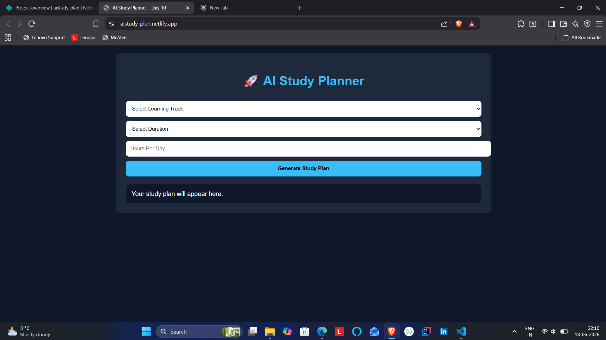
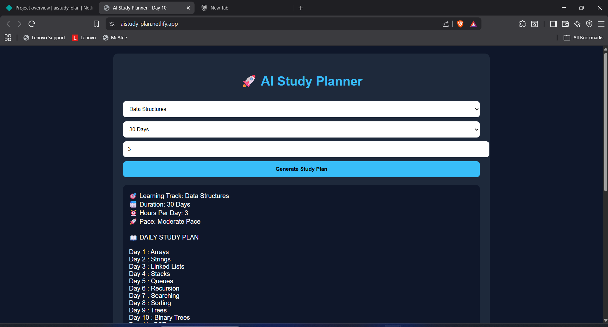
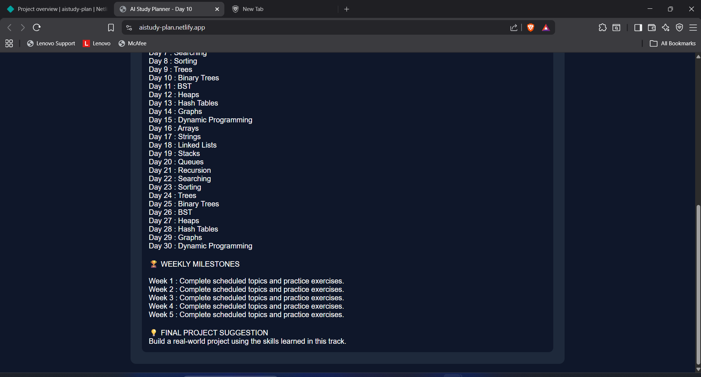

# AI Study Planner

🚀 Day 10 of my 30 Days 30 AI Websites Challenge

AI Study Planner is a simple web application that generates a personalized daily study plan based on a selected learning track, study duration, and available study hours.

## 🌐 Live Demo

https://aistudy-plan.netlify.app/

## 📸 Screenshots

## ✨ Features

✅ Learning Track Selection

✅ Daily Study Plan Generation

✅ Weekly Milestones

✅ Study Pace Detection

✅ Multiple Learning Paths

✅ Beginner-Friendly Interface

## 🎯 Supported Learning Tracks

* Data Structures
* Python
* Web Development
* Data Science
* Machine Learning

## 🛠 Technologies Used

* HTML
* CSS
* JavaScript
* AI-Assisted Development

## 📋 How It Works

1. Select a learning track.
2. Choose study duration.
3. Enter study hours per day.
4. Click "Generate Study Plan".
5. View your personalized daily learning schedule.

## 🎯 Example

Learning Track: Data Structures

Duration: 30 Days

Hours Per Day: 2

Output:

* Day 1: Arrays
* Day 2: Strings
* Day 3: Linked Lists
* Day 4: Stacks
* Day 5: Queues

...and so on.

## 🚀 Challenge

This project is part of my 30 Days 30 AI Websites Challenge where I build and publish one AI-assisted website every day.

### Progress

* Day 1 ✅ AI Resume Analyzer
* Day 2 ✅ AI Career Roadmap Generator
* Day 3 ✅ AI Project Idea Generator
* Day 4 ✅ AI Skill Gap Analyzer
* Day 5 ✅ AI Interview Question Generator
* Day 6 ✅ AI Portfolio Review Analyzer
* Day 7 ✅ AI LinkedIn Post Generator
* Day 8 ✅ AI Salary Predictor
* Day 9 ✅ AI Startup Idea Validator
* Day 10 ✅ AI Study Planner

## 👨‍💻 Author

Anand,

B.Tech CSE(Data Science)

